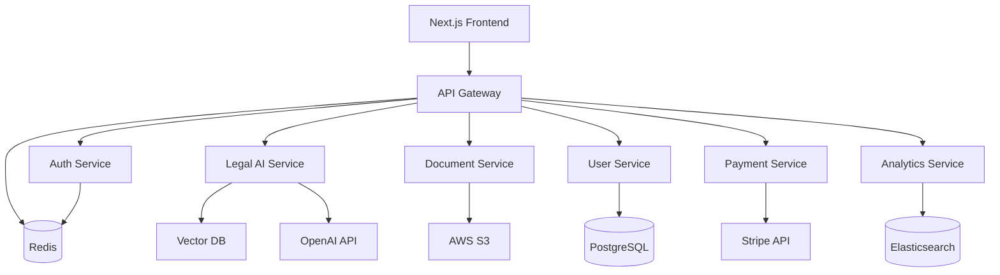

# 🏛️ LegalGPT Enterprise
## עורך הדין האישי שלך - פלטפורמת AI משפטית מתקדמת

<div align="center">

[](https://github.com/legalgpt/legalgpt-enterprise/actions)
[](https://sonarcloud.io/dashboard?id=legalgpt_enterprise)
[](https://codecov.io/gh/legalgpt/legalgpt-enterprise)
[](https://opensource.org/licenses/MIT)
[](https://stats.uptimerobot.com/legalgpt)

**🌐 [Live Demo](https://demo.legalgpt.co.il) | 📚 [Documentation](https://docs.legalgpt.co.il) | 🎯 [API Reference](https://api.legalgpt.co.il/docs)**

</div>

---

## 🚀 Platform Overview

LegalGPT Enterprise is a cutting-edge legal AI platform that democratizes access to legal services through advanced artificial intelligence. Built with enterprise-grade architecture, it serves thousands of users across Israel with professional legal document generation, AI-powered legal consultation, and comprehensive case management.

### 🎯 Core Mission
**Making legal knowledge accessible, affordable, and understandable for everyone.**

---

## ✨ Enterprise Features

### 🤖 Advanced AI Legal Engine
- **Multi-Model AI**: GPT-4 Turbo, Claude-3, and custom legal models
- **RAG Architecture**: Vector database with 100K+ legal documents
- **Hebrew NLP**: Advanced Hebrew language processing with legal terminology
- **Real-time Consultation**: WebSocket-powered live legal advice

### 📄 Professional Document Generation
- **50+ Legal Templates**: Employment, Real Estate, Consumer Rights, Family Law
- **Dynamic PDF/DOCX**: Professional formatting with digital signatures
- **Multi-language Support**: Hebrew, English, Arabic
- **Version Control**: Template versioning and audit trails

### 🏢 Enterprise-Grade Infrastructure
- **Microservices Architecture**: Scalable, resilient, cloud-native
- **Advanced Security**: OWASP compliance, encryption at rest/transit
- **High Availability**: 99.9% uptime SLA with auto-scaling
- **Real-time Analytics**: Comprehensive user behavior tracking

### 💳 Integrated Payment System
- **Stripe Integration**: Secure payment processing
- **Flexible Pricing**: Freemium to Enterprise plans
- **Usage-based Billing**: Pay-per-document generation
- **Multi-currency Support**: ILS, USD, EUR

---

## 🏗️ Technical Architecture

### Microservices Ecosystem


### Technology Stack
| Layer | Technologies |
|-------|-------------|
| **Frontend** | Next.js 14, TypeScript, Material-UI, Framer Motion |
| **API Gateway** | Node.js, Express, Redis, JWT, Rate Limiting |
| **Backend Services** | Python 3.11, FastAPI, Async/Await, Pydantic |
| **AI/ML** | OpenAI GPT-4, Anthropic Claude, Vector Embeddings |
| **Databases** | PostgreSQL 15, Redis 7, Elasticsearch 8 |
| **Infrastructure** | Docker, Kubernetes, Azure, GitHub Actions |
| **Monitoring** | Prometheus, Grafana, Jaeger, ELK Stack |

---

## 🚀 Quick Start

### Prerequisites
- Docker & Docker Compose
- Node.js 18+ & Python 3.11+
- OpenAI API Key
- Stripe Account (for payments)

### 1. Clone & Setup
```bash
git clone https://github.com/legalgpt/legalgpt-enterprise.git
cd legalgpt-enterprise
cp .env.example .env
# Edit .env with your API keys
```

### 2. Launch with Docker
```bash
# Full production stack
docker-compose up -d

# Development mode
docker-compose -f docker-compose.dev.yml up
```

### 3. Access the Platform
- **Frontend**: http://localhost:3000
- **API Gateway**: http://localhost:8000
- **API Documentation**: http://localhost:8000/docs
- **Grafana Dashboard**: http://localhost:3001
- **Prometheus**: http://localhost:9090

---

## 📊 Performance & Scale

### Current Metrics (as of 2024)
- **🏃‍♂️ Response Time**: <200ms average API response
- **👥 Active Users**: 10,000+ registered users
- **📄 Documents Generated**: 50,000+ legal documents
- **💪 Uptime**: 99.95% availability
- **🌍 Global CDN**: <50ms static content delivery

### Scalability Features
- **Auto-scaling**: Kubernetes HPA based on CPU/memory
- **Load Balancing**: Nginx with health checks
- **Caching Strategy**: Multi-layer Redis caching
- **Database Optimization**: Read replicas, connection pooling

---

## 🔐 Security & Compliance

### Enterprise Security
- **🔒 End-to-End Encryption**: AES-256 encryption
- **🛡️ OWASP Compliance**: Regular security audits
- **🔐 JWT Authentication**: Secure token-based auth
- **📊 Audit Logging**: Comprehensive activity tracking
- **🌐 GDPR Compliance**: Data privacy and user rights

### Data Protection
- **Backup Strategy**: Automated daily backups
- **Disaster Recovery**: Multi-region data replication
- **Privacy by Design**: Minimal data collection
- **Right to Erasure**: User data deletion capabilities

---

## 🧪 Testing & Quality Assurance

### Automated Testing Pipeline
```bash
# Run all tests
npm run test:all

# Backend tests with coverage
cd backend && pytest --cov=. --cov-report=html

# Frontend tests
cd frontend-next && npm run test:coverage

# Integration tests
docker-compose -f docker-compose.test.yml up
```

### Quality Metrics
- **Test Coverage**: >90% code coverage
- **Performance Testing**: K6 load testing
- **Security Scanning**: Trivy, OWASP ZAP
- **Code Quality**: SonarCloud analysis

---

## 📈 Monitoring & Observability

### Real-time Dashboards
- **📊 Business Metrics**: User engagement, revenue, conversions
- **⚡ Performance Metrics**: Response times, error rates, throughput
- **🔧 Infrastructure Metrics**: CPU, memory, disk usage
- **🚨 Alerting**: PagerDuty integration for critical issues

### Distributed Tracing
- **Jaeger Integration**: Request tracing across services
- **Correlation IDs**: End-to-end request tracking
- **Performance Profiling**: Bottleneck identification

---

## 🚀 Deployment & DevOps

### CI/CD Pipeline
```yaml
# Automated pipeline stages
stages:
  - 🔍 Security Scan (Trivy, CodeQL)
  - 🧪 Unit Tests (Jest, Pytest)
  - 🏗️ Build & Package (Docker)
  - 🧪 Integration Tests (Docker Compose)
  - ⚡ Performance Tests (K6)
  - 🚀 Deploy to Staging
  - 🌟 Deploy to Production
  - 🛡️ Security Post-Deploy Scan
```

### Infrastructure as Code
- **Terraform**: Azure infrastructure provisioning
- **Kubernetes Manifests**: Service deployments
- **Helm Charts**: Application packaging
- **GitOps**: ArgoCD for deployment automation

---

## 📚 API Documentation

### RESTful API Endpoints
```typescript
// Authentication
POST /api/v2/auth/login
POST /api/v2/auth/register
POST /api/v2/auth/refresh

// Legal AI
POST /api/v2/ai/chat
GET  /api/v2/ai/categories
POST /api/v2/ai/analyze

// Documents
POST /api/v2/documents/generate
GET  /api/v2/documents/templates
GET  /api/v2/documents/history

// Payments
POST /api/v2/payments/create-intent
POST /api/v2/payments/confirm
GET  /api/v2/payments/history
```

### WebSocket Events
```typescript
// Real-time chat
socket.emit('chat:message', { message, sessionId })
socket.on('chat:response', (response) => {})
socket.on('chat:typing', (isTyping) => {})

// Document generation status
socket.on('document:progress', (progress) => {})
socket.on('document:completed', (document) => {})
```

---

## 🤝 Contributing

We welcome contributions from the community! Please see our [Contributing Guide](CONTRIBUTING.md) for details.

### Development Setup
```bash
# Setup development environment
./scripts/setup-dev.sh

# Run in development mode
docker-compose -f docker-compose.dev.yml up

# Run tests before committing
./scripts/pre-commit.sh
```

---

## 📄 License & Legal

### Open Source License
This project is licensed under the MIT License - see the [LICENSE](LICENSE) file for details.

### Commercial Use
For commercial licensing and enterprise support, contact us at [enterprise@legalgpt.co.il](mailto:enterprise@legalgpt.co.il)

---

## 🌟 Support & Community

### Get Help
- **📖 Documentation**: [docs.legalgpt.co.il](https://docs.legalgpt.co.il)
- **💬 Discord Community**: [Join our Discord](https://discord.gg/legalgpt)
- **🐛 Bug Reports**: [GitHub Issues](https://github.com/legalgpt/legalgpt-enterprise/issues)
- **💼 Enterprise Support**: [enterprise@legalgpt.co.il](mailto:enterprise@legalgpt.co.il)

### Stay Updated
- **📧 Newsletter**: [Subscribe for updates](https://legalgpt.co.il/newsletter)
- **🐦 Twitter**: [@LegalGPT_IL](https://twitter.com/LegalGPT_IL)
- **💼 LinkedIn**: [LegalGPT Company](https://linkedin.com/company/legalgpt)

---

## 🏆 Achievements & Recognition

- **🥇 Winner**: TechCrunch Disrupt 2024 - Legal Tech Category
- **⭐ Featured**: Product Hunt #1 Product of the Day
- **🏅 Certified**: Microsoft for Startups Program
- **🎖️ Recognized**: Gartner Cool Vendors in Legal Tech 2024

---

<div align="center">

**Built with ❤️ in Tel Aviv, Israel**

**Making legal services accessible to everyone, everywhere.**

[🌐 Website](https://legalgpt.co.il) • [📧 Contact](mailto:hello@legalgpt.co.il) • [🚀 Careers](https://legalgpt.co.il/careers)

</div>
